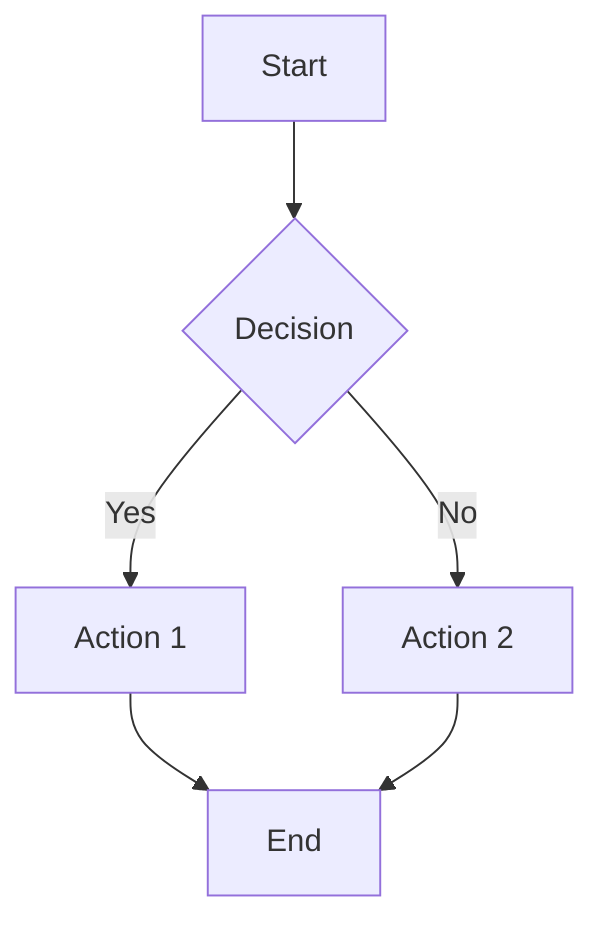

# mdterm Feature Showcase

A comprehensive test file for all mdterm features. Open with `mdterm test.md` and try the keybindings listed below.

## Text Formatting

Regular text, **bold text**, *italic text*, ~~strikethrough text~~, and `inline code`.

Combine them: ***bold italic***, **~~bold strikethrough~~**, *~~italic strikethrough~~*.

## Headings (all levels)

### H3 Heading

#### H4 Heading

##### H5 Heading

###### H6 Heading

## Links (clickable via OSC 8)

Visit [Rust](https://www.rust-lang.org) or check out [mdterm on GitHub](https://github.com/bahdotsh/mdterm).

Multiple links: [Google](https://google.com), [Wikipedia](https://en.wikipedia.org), [Hacker News](https://news.ycombinator.com).

Press `f` to open the link picker and jump to any link.

## Images


## Math Rendering

Inline math: $E = mc^2$, $\alpha + \beta = \gamma$, $x \in \mathbb{R}$

The quadratic formula: $x = \frac{-b \pm \sqrt{b^2 - 4ac}}{2a}$

Greek letters: $\alpha, \beta, \gamma, \delta, \epsilon, \theta, \lambda, \mu, \pi, \sigma, \omega$

Display math:

$$\sum_{i=1}^{n} x_i = \frac{n(n+1)}{2}$$

$$\int_0^{\infty} e^{-x^2} dx = \frac{\sqrt{\pi}}{2}$$

$$\forall x \in \mathbb{R}, \exists y : x^2 + y^2 \leq 1 \implies |x| \leq 1$$

## Code Blocks (with syntax highlighting)

Toggle line numbers with `l`. Copy a code block with `c`.

```rust
use std::collections::HashMap;

fn main() {
    let mut scores: HashMap<&str, i32> = HashMap::new();
    scores.insert("Alice", 95);
    scores.insert("Bob", 87);
    scores.insert("Charlie", 92);

    for (name, score) in &scores {
        println!("{}: {}", name, score);
    }
}
```

```python
import asyncio

async def fetch_data(url: str) -> dict:
    """Fetch data from a URL asynchronously."""
    await asyncio.sleep(1)
    return {"url": url, "status": 200}

async def main():
    urls = ["https://api.example.com/a", "https://api.example.com/b"]
    tasks = [fetch_data(url) for url in urls]
    results = await asyncio.gather(*tasks)
    for r in results:
        print(f"{r['url']} -> {r['status']}")

asyncio.run(main())
```

```javascript
const debounce = (fn, ms) => {
  let timer;
  return (...args) => {
    clearTimeout(timer);
    timer = setTimeout(() => fn(...args), ms);
  };
};
```

```go
package main

import "fmt"

func fibonacci(n int) int {
    if n <= 1 {
        return n
    }
    return fibonacci(n-1) + fibonacci(n-2)
}

func main() {
    for i := 0; i < 10; i++ {
        fmt.Printf("fib(%d) = %d\n", i, fibonacci(i))
    }
}
```

## Diagram Blocks (mermaid detection)



## Lists

### Unordered

- First item
- Second item
  - Nested item A
  - Nested item B
    - Deeply nested
- Third item

### Ordered

1. Step one
2. Step two
   1. Sub-step A
   2. Sub-step B
3. Step three

### Task List

- [x] Clickable links (OSC 8)
- [x] Heading outline / TOC (`o` key)
- [x] Follow mode (`--follow`)
- [x] Stdin support (`cat file | mdterm`)
- [x] Image placeholders
- [x] Heading jumps (`[` / `]`)
- [x] Link picker (`f` key)
- [x] Copy to clipboard (`y` / `Y` / `c`)
- [x] Multiple files (`Tab` / `Shift+Tab`)
- [x] CLI flags (`--help`, `--version`, etc.)
- [x] Config file (`~/.config/mdterm/config.toml`)
- [x] Line numbers (`l` key or `--line-numbers`)
- [x] Code block copy (`c` key)
- [x] Regex search (`/` with patterns)
- [x] Scrollbar
- [x] Mermaid/diagram detection
- [x] Slide mode (`--slides`)
- [x] HTML export (`--export html`)
- [x] Fuzzy heading search (`:` key)
- [x] Math rendering (LaTeX to Unicode)
- [ ] Even more features to come!

## Blockquotes

> "The only way to do great work is to love what you do."
> — Steve Jobs

> Blockquotes can contain **formatting**, `code`, and even
> *nested emphasis* within them.

## Tables

| Feature | Keybinding | Description |
|---------|:----------:|-------------|
| Scroll | `j`/`k` | Line by line |
| Page | `Space`/`b` | Full viewport |
| Search | `/` | Regex-enabled search |
| TOC | `o` | Table of contents overlay |
| Links | `f` | Open links in browser |
| Copy | `y`/`Y` | Section / full document |
| Heading Jump | `[`/`]` | Previous / next heading |
| Theme | `t` | Toggle dark/light |
| Line Numbers | `l` | Toggle code line numbers |
| Fuzzy Search | `:` | Search headings |
| Quit | `q` | Exit viewer |

| Alignment Test | Left | Center | Right |
|:---------------|:-----|:------:|------:|
| Row 1 | L1 | C1 | R1 |
| Row 2 | L2 | C2 | R2 |
| Row 3 | L3 | C3 | R3 |

## Horizontal Rules (slide separators in `--slides` mode)

Content above the rule.

---

Content between rules. In slide mode (`mdterm --slides test.md`), each `---` becomes a slide boundary. Use arrow keys to navigate between slides.

---

More content after another rule.

## Search Test Section

Try searching (`/`) for these terms:
- "fibonacci" — finds it in code blocks
- "feature" — finds multiple matches
- "[a-z]+ing" — regex pattern matching words ending in "ing"
- "TODO" — no match, shows "no match" indicator

## Long Content for Scrollbar Testing

Lorem ipsum dolor sit amet, consectetur adipiscing elit. Sed do eiusmod tempor incididunt ut labore et dolore magna aliqua. Ut enim ad minim veniam, quis nostrud exercitation ullamco laboris nisi ut aliquip ex ea commodo consequat.

Duis aute irure dolor in reprehenderit in voluptate velit esse cillum dolore eu fugiat nulla pariatur. Excepteur sint occaecat cupidatat non proident, sunt in culpa qui officia deserunt mollit anim id est laborum.

Curabitur pretium tincidunt lacus. Nulla gravida orci a odio. Nullam varius, turpis et commodo pharetra, est eros bibendum elit, nec luctus magna felis sollicitudin mauris. Integer in mauris eu nibh euismod gravida.

Duis ac tellus et risus vulputate vehicula. Donec lobortis risus a elit. Etiam tempor. Ut ullamcorper, ligula ut dictum pharetra, nisi nunc fringilla magna, in commodo elit erat nec turpis. Ut pharetra purus quis id congue.

Praesent dapibus, neque id cursus faucibus, tortor neque egestas auguae, eu vulputate magna eros eu erat. Aliquam erat volutpat. Nam dui mi, tincidunt quis, accumsan porttitor, facilisis luctus, metus.

## Final Section

You've reached the bottom! Try these:

1. Press `g` to jump back to top
2. Press `o` to see the table of contents
3. Press `:` to fuzzy-search a heading
4. Press `t` to toggle dark/light theme
5. Press `q` to quit

---

*Built with Rust, rendered with love.*
